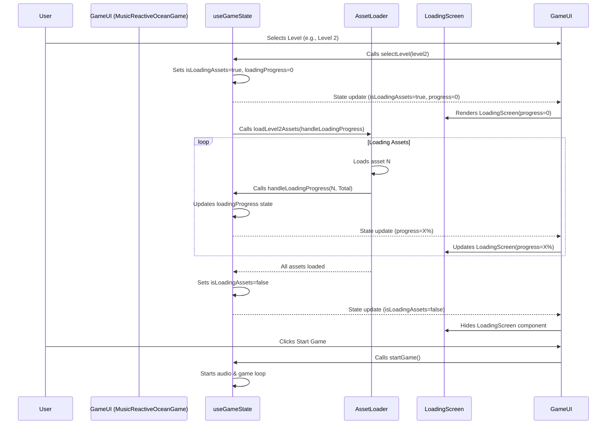

# Plan: Visual Preloader with Progress Indicator

**Goal:** Implement a visual loading screen with a progress bar that displays while game assets are loaded between levels. This enhances user experience by providing feedback during potentially long loading times.

**Implementation Steps:**

1.  **Modify `AssetLoader` (`src/utils/assetLoader.ts`):**
    *   **Add Progress Callback:** Update level-specific loading functions (`loadLevel2Assets`, `loadLevel3Assets`, potentially `loadBasicAssets` and `loadFloraAssets` if needed for initial load) to accept an optional `onProgress` callback argument: `onProgress?: (loaded: number, total: number) => void`.
    *   **Track Progress:**
        *   Determine the total number of assets (promises) being loaded for the function.
        *   Maintain a counter for successfully loaded assets.
        *   Iterate through individual asset loading promises. As each promise resolves, increment the loaded counter and invoke `onProgress(loaded, total)`.
        *   Ensure `onProgress(total, total)` is called upon completion.

2.  **Modify `useGameState` (`src/hooks/useGameState.ts`):**
    *   **Centralize Loading Logic:** Ensure `selectLevel` is the sole trigger for level-specific asset loading.
    *   **Add State:**
        *   `const [isLoadingAssets, setIsLoadingAssets] = useState(false);`
        *   `const [loadingProgress, setLoadingProgress] = useState(0);` // Percentage (0-100)
    *   **Implement Callback:** Create `handleLoadingProgress(loaded, total)` to calculate percentage and call `setLoadingProgress`.
    *   **Modify `selectLevel`:**
        *   Set `setIsLoadingAssets(true)` and `setLoadingProgress(0)` at the start.
        *   Wrap asset loading calls (`await assetLoader.loadLevelXAssets(...)`) in `try...finally`.
        *   Pass `handleLoadingProgress` to the asset loader calls.
        *   Set `setIsLoadingAssets(false)` in the `finally` block.
    *   **Return State:** Return `isLoadingAssets` and `loadingProgress` from the hook.

3.  **Refactor `MusicReactiveOceanGame.tsx`:**
    *   **Remove Redundant Loading:** Eliminate `useEffect` hooks and `startGame` logic that duplicates asset loading handled by `useGameState.selectLevel`.
    *   **Remove Local State:** Remove local `isLoading`, `levelXAssetsLoaded` state variables.
    *   **Consume Central State:** Get `isLoadingAssets` and `loadingProgress` from the `useGameState()` hook.

4.  **Create UI Component (`src/components/GameUI/LoadingScreen.tsx`):**
    *   Create the new file `src/components/GameUI/LoadingScreen.tsx`.
    *   Define props: `interface LoadingScreenProps { progress: number; }`.
    *   Implement a component rendering a full-screen overlay.
    *   Display the progress visually (e.g., text `Loading... {props.progress}%` and/or a progress bar element styled with CSS).

5.  **Conditional Rendering (`MusicReactiveOceanGame.tsx`):**
    *   Import `LoadingScreen`.
    *   In the main component's JSX, add conditional rendering: `{isLoadingAssets && <LoadingScreen progress={loadingProgress} />}`.

**Sequence Diagram:**

**Next Steps:**

*   Implement the changes outlined above.
*   Conduct the general performance audit after the preloader is functional.